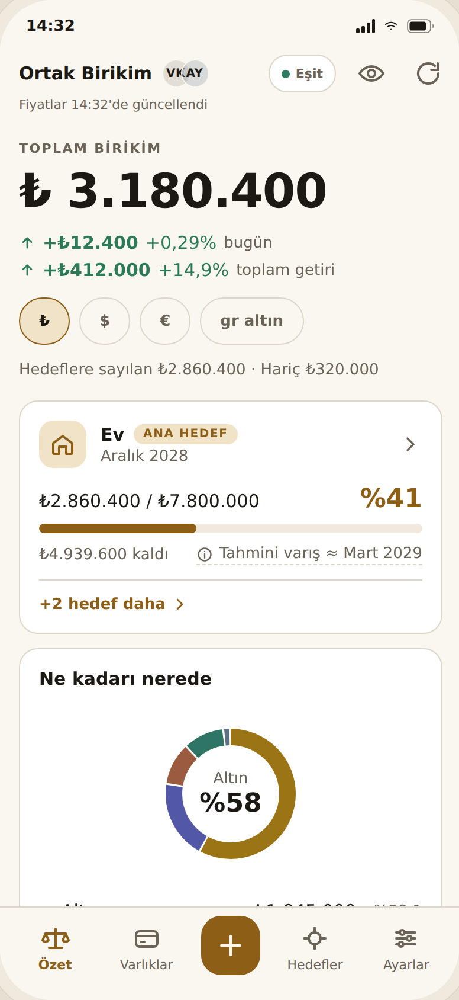
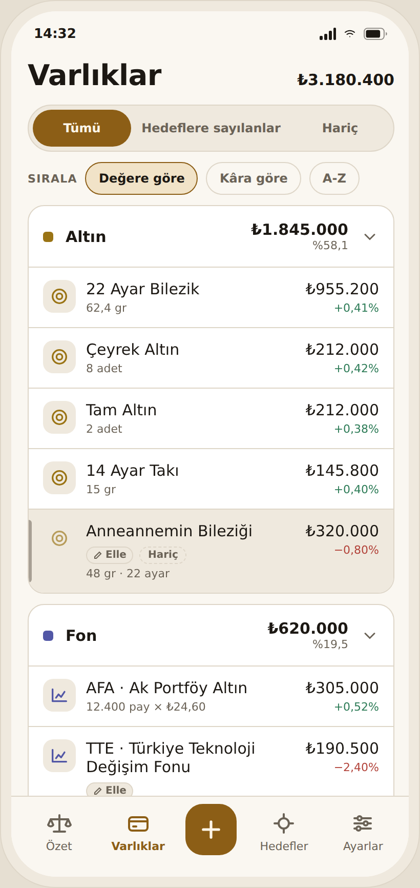
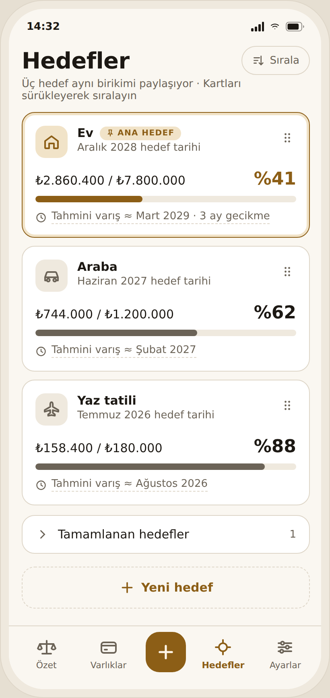
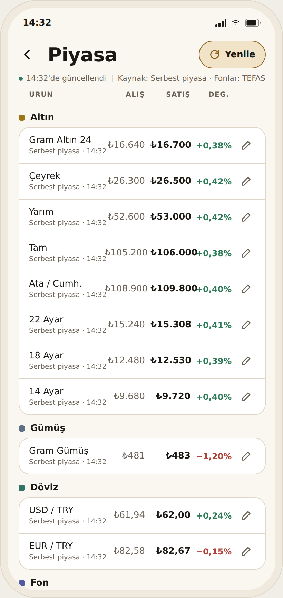
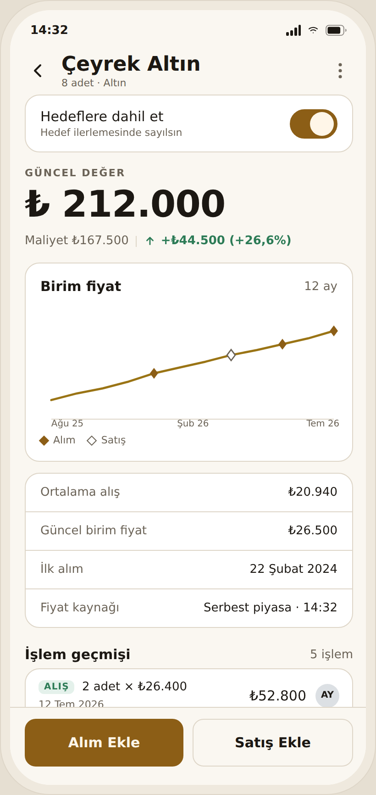
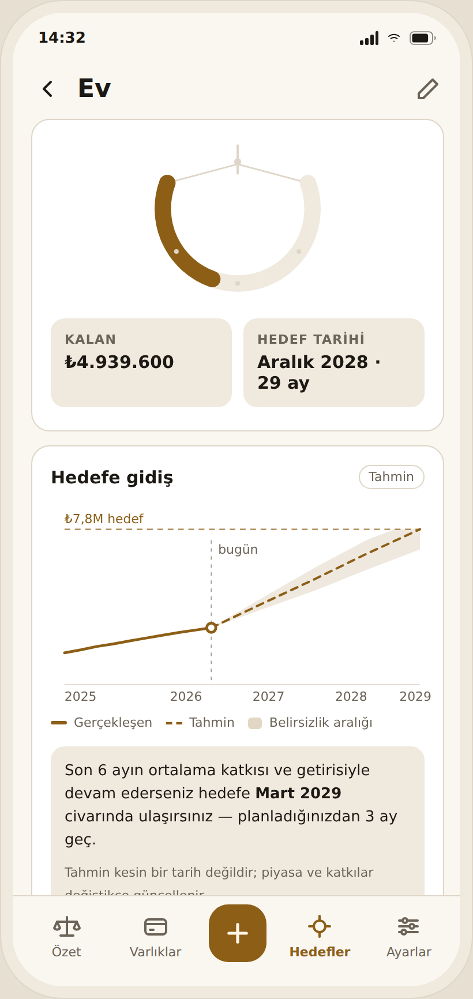
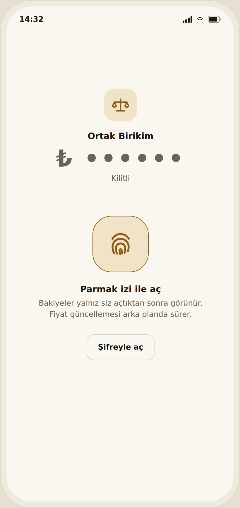
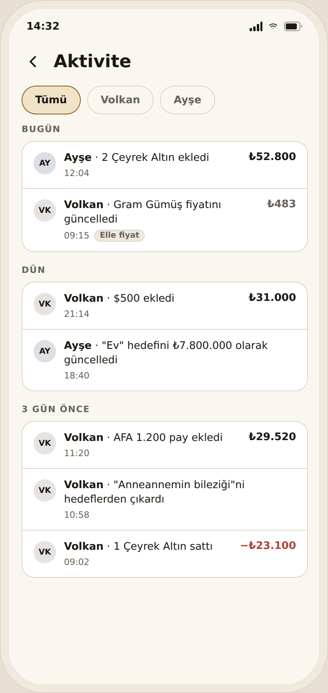
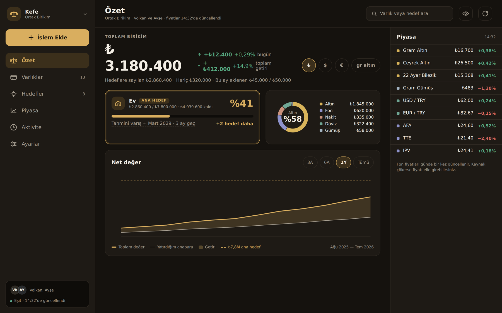
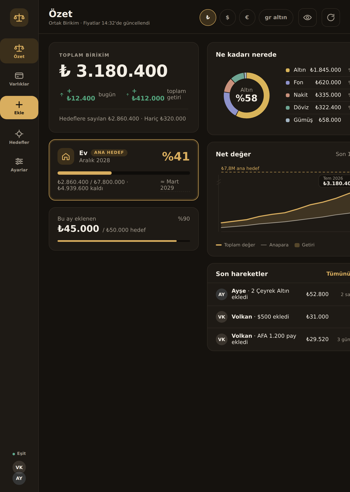

<div align="center">


# Kefe

**Offline-first net-worth tracker for two people — one Kotlin codebase on Android, iOS and desktop.**

Gold, silver, foreign currency, funds, equities and cash in one portfolio.
Live prices from public sources, everything stored on-device first, cloud sync optional.


</div>

---

## Screens

| Summary | Assets | Goals | Market |
|:---:|:---:|:---:|:---:|
|  |  |  |  |

| Asset detail | Goal detail | Biometric lock | Activity |
|:---:|:---:|:---:|:---:|
|  |  |  |  |

<div align="center">
<br/>
<sub>Same code, adaptive layouts — desktop and tablet</sub><br/><br/>

</div>

---

## The mark


A catenary — a chain hanging under load. The deeper it sags, the closer the goal.

It isn't a circular arc: in a catenary the curvature concentrates at the bottom, in an
arc it's constant everywhere. An arc reads as a *smile*, a chain reads as *tension*.
The `cosh`/`sinh` math in `ChainCurve.kt` exists to preserve exactly that difference,
and the mark simplifies in four steps as it shrinks — at 16dp only the load remains.

<br clear="right" />

---

## Architecture

```
composeApp/src/
├── commonMain/          ~90% of the code, shared across all three targets
│   ├── ui/              screens · components · 8 hand-drawn charts · brand
│   ├── domain/          pure Kotlin: Position, Valuation, CostBasis, Returns, Goal
│   ├── data/
│   │   ├── db/          SQLDelight — the single source of truth
│   │   ├── remote/      Ktor: TEFAS, TCMB, free market, equities, Supabase
│   │   └── sync/        PushEngine · PullEngine · SyncCoordinator
│   ├── security/        expect: SecureStore, BiometricGate
│   └── di/              Koin
├── androidMain/         actual: Keystore, BiometricPrompt, OkHttp
├── iosMain/             actual: Keychain, LocalAuthentication, Darwin
└── desktopMain/         actual: JVM SQLite driver, CIO
```

MVI with one immutable `UiState` per screen. **The database is the source of truth, not
the network** — repositories return `Flow` from SQLDelight, and a price refresh is a
*write* to the local DB. That's what makes offline not a special case, just the normal
case with one writer switched off.

---

## Decisions worth reading

**Multi-tenancy was built, then deliberately torn out.** Accounts, invitations,
membership permissions — all of it worked, and all of it went. The real requirement was
one household: *one Supabase account, two devices, each pinned to a profile.* That
deleted the invite flow, the permission matrix and the need for a domain. Generality you
don't need is surface area you have to defend.

**Token encryption shipped *before* sync, on purpose.** The session token sat in the
database in plaintext. Tolerable while the account held nothing — but the moment sync
landed, that token would mean the entire savings history. `SecureStore` came first, and
its `reveal()` returns unrecognised text as-is, so old plaintext sessions keep working
and silently re-encrypt. No migration, no forced logout.

**"Offline" was two different facts wearing one label.** The sync chip was driven by
*price freshness*: when a free price endpoint hiccuped, the app declared itself offline
while cloud sync was working fine — and wrote records to disk stamped *pending*. Price
staleness and cloud reachability are now separate signals (`CloudState` derives from
real Supabase round-trips).

**Four price sources, because one won't do.** TCMB for official FX (keyless, falls back
to the previous bulletin so weekends work) · free market for gold and silver, because a
quarter coin *cannot* be derived from the ounce — it carries mint premium and
craftsmanship, so computed values come out systematically low · TEFAS for funds, fetching
a one-month series since day/week/month change needs consecutive points · one equities
source covering BIST, US and Europe by symbol suffix. All keyless, all fragile: each is
wrapped in retry, and on failure the last known price stays on screen with a staleness
banner.

**Domain modelling follows real life, not the schema.** Karat is asked where the user
knows it and implied where the form dictates it — previously someone holding 22k *gram*
gold had to file it as "jewellery", so the arithmetic was right but the screen lied.
`Lot` is a separate unit from `Piece` because a quarter coin doesn't divide but a share
does. Profit is shown in lira, not percent: a spreadsheet wants percentages, a person
wants "you're up ₺4,200".

**Charts are hand-drawn on Compose `Canvas`.** No chart dependency — the libraries that
ship Android views don't compile to iOS or desktop, and the ones that do meant adopting
someone else's animation and theming model.

---

## Testing

25 test classes, and the project rule is explicit: **a step is done only when verified on
a device *and* by a test.** Looking at a screenshot doesn't count.

Coverage sits where bugs are expensive and silent — money arithmetic (`CostBasis`,
`Valuation`, `Returns`, `Precision`, `ForeignMoney`, `Projection`), the sync engines
(`PushEngine`, `PullEngine`, `SoftDelete`, `AuthSession`, three Realtime suites), and
every fragile third-party parser (`TefasDate`, `StockParse`, `StockDate`,
`StockCurrency`, `PriceFreshness`).

---

## Stack

Kotlin 2.4 Multiplatform · Compose Multiplatform 1.11 + Material 3 + Navigation 3 ·
SQLDelight 2.3 · Ktor 3.5 (OkHttp / Darwin / CIO, WebSockets) · kotlinx.serialization ·
Coroutines + Flow · Koin 4.2 · Supabase (PostgREST, Auth, Realtime, RLS) ·
Android Keystore & iOS Keychain

Versions are pinned in `gradle/libs.versions.toml`, each with a comment explaining *why*
that exact version — which releases were broken, which constraint set the floor.

---

## Running it

Requires JDK 17+, Android SDK 37, Xcode 15+ for iOS.

```bash
git clone https://github.com/BcanGRG/Kefe.git && cd Kefe

./gradlew :composeApp:assembleDebug     # Android
./gradlew :composeApp:run               # Desktop
./gradlew :composeApp:desktopTest       # Tests
```

Cloud sync is optional — skip it and everything stays on device. To enable: create a
Supabase project, run `supabase/schema.sql` (tables, RLS policies, Realtime publication),
add your project URL and anon key, then sign in from Settings.

---

<div align="center">

**Burak Can Görgülü** · Android Developer

[](https://github.com/BcanGRG)
[](https://linkedin.com/in/burakcangorgulu23)

</div>
