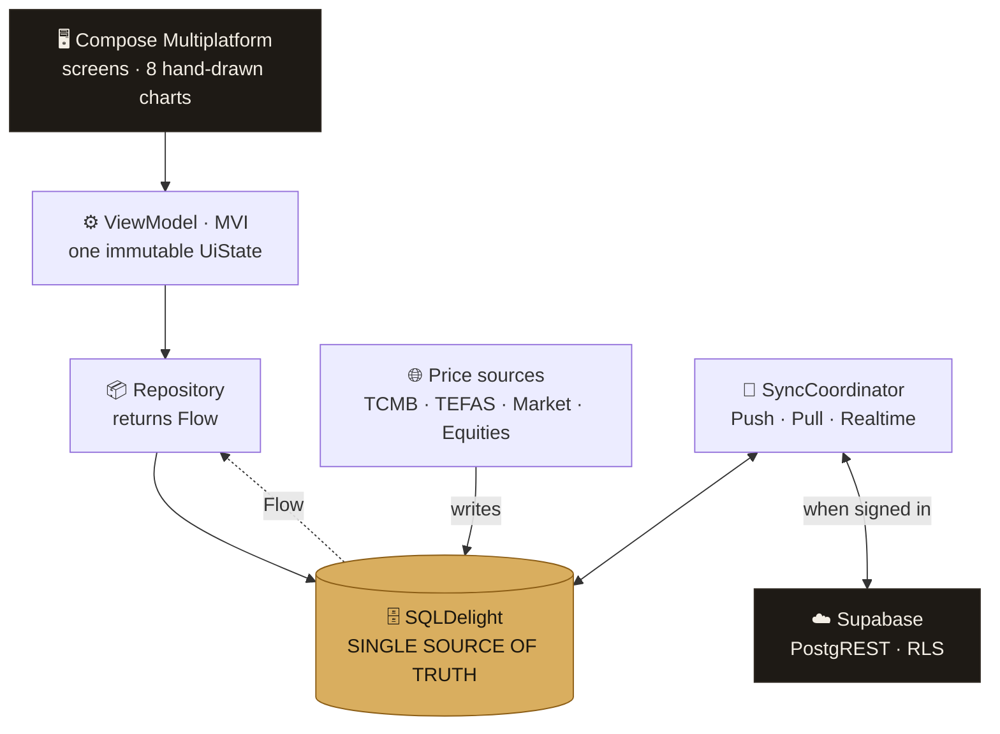
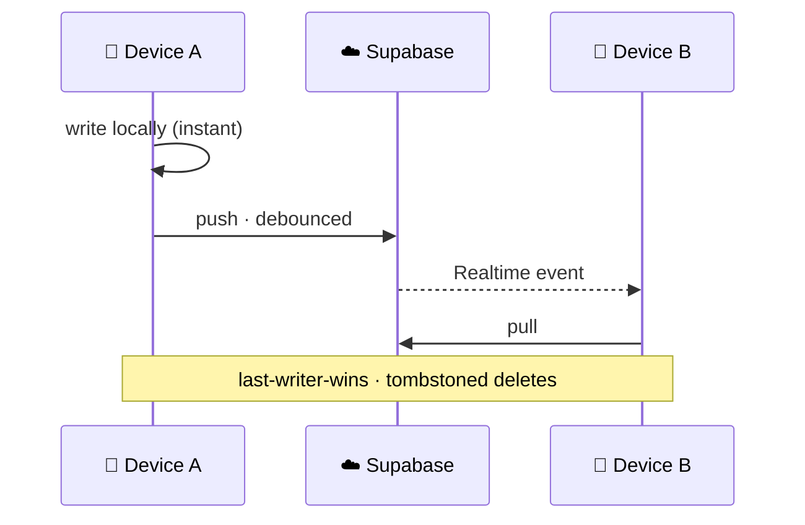

<div align="center">


# Kefe

### Offline-first net-worth tracker for two people
**One Kotlin codebase · Android · iOS · Desktop**


<br/>


</div>

---

<div align="center">

### 🥇 Six asset classes, one number

</div>

<div align="center">

| 🥇 Gold | 🥈 Silver | 💱 FX | 📊 Funds | 📈 Equities | 💵 Cash |
|:---:|:---:|:---:|:---:|:---:|:---:|
| gram · quarter · half<br/>full · Ata · jewellery<br/>**14–24 karat** | gram<br/>bullion | TCMB<br/>official rates | **TEFAS**<br/>daily NAV | BIST · US<br/>Europe | multi<br/>currency |

</div>

---

## 🎨 Same code, adaptive layouts

<div align="center">

<br/>
<sub>Desktop — the phone's bottom bar becomes a rail, the market panel gets its own column</sub>
</div>

---

## 🔗 The mark


A **catenary** — a chain hanging under load.
The deeper it sags, the closer the goal.

Not a circular arc: in a catenary curvature
concentrates at the bottom. An arc reads as a
*smile*, a chain reads as *tension*.

Drawn at runtime from `cosh`/`sinh`, and it
simplifies in four steps as it shrinks — at
16dp only the load remains.

<br clear="right" />

---

## 🏗️ Architecture



> **The database is the source of truth, not the network.**
> A price refresh is a *write* to the local DB. That's why offline isn't a special case —
> it's the normal case with one writer switched off.

<div align="center">

| `commonMain` | `androidMain` | `iosMain` | `desktopMain` |
|:---:|:---:|:---:|:---:|
| **~90%** of the code | Keystore<br/>BiometricPrompt | Keychain<br/>LocalAuth | JVM SQLite<br/>CIO |

</div>

---

## 🧠 Decisions

<div align="center">

| | Decision | Why |
|:---:|---|---|
| 🗑️ | **Built multi-tenancy, then deleted it** | Real need was one household. One account, two devices, each pinned to a profile — that removed the invite flow, permission matrix and domain requirement |
| 🔐 | **Token encryption shipped *before* sync** | The token sat in plaintext. Harmless while the account held nothing — the day sync landed it would mean the whole savings history |
| 📡 | **Split "offline" into two signals** | Price staleness ≠ cloud reachability. A dead price feed used to make the app declare itself offline while sync worked fine |
| 🪙 | **Four price sources, not one** | A quarter coin can't be derived from the ounce — it carries mint premium and craftsmanship |
| ⚖️ | **Karat asked, not assumed** | 22k *gram* gold had to be filed as "jewellery": arithmetic right, screen lying |
| ✏️ | **Charts hand-drawn on Canvas** | Chart libraries that ship Android views don't compile to iOS or desktop |
| ₺ | **Profit in lira, not percent** | A spreadsheet wants %. A person wants "you're up ₺4,200" |

</div>

---

## 🔄 Sync



Event-driven and debounced — reacts to auth state, connectivity, foreground and
Supabase Realtime over WebSocket. Deletes are tombstoned so a stale pull can't
resurrect them.

---

## 🧪 Testing

<div align="center">

**A step is done only when verified on a device *and* by a test.**

| 💰 Money | 🔄 Sync | 🌐 Parsers |
|:---:|:---:|:---:|
| CostBasis · Valuation<br/>Returns · Precision<br/>ForeignMoney · Projection | PushEngine · PullEngine<br/>SoftDelete · AuthSession<br/>3× Realtime | TefasDate · StockParse<br/>StockDate · StockCurrency<br/>PriceFreshness |

`25 suites` — aimed where bugs are expensive and silent

</div>

---

## 🚀 Run

```bash
git clone https://github.com/BcanGRG/Kefe.git && cd Kefe

./gradlew :composeApp:assembleDebug     # 🤖 Android
./gradlew :composeApp:run               # 🖥️ Desktop
./gradlew :composeApp:desktopTest       # 🧪 Tests
```

<details>
<summary><b>☁️ Optional cloud sync</b></summary>

<br/>

The app is fully functional without this — skip it and everything stays on device.

1. Create a Supabase project
2. Run `supabase/schema.sql` — tables, RLS policies, Realtime publication
3. Add your project URL and anon key
4. Sign in from Settings

</details>

<details>
<summary><b>📦 Stack detail</b></summary>

<br/>

Kotlin 2.4 MP · Compose Multiplatform 1.11 · Material 3 · Navigation 3 ·
SQLDelight 2.3 · Ktor 3.5 (OkHttp / Darwin / CIO + WebSockets) ·
kotlinx.serialization · Coroutines + Flow · Koin 4.2 ·
Supabase (PostgREST · Auth · Realtime · RLS) · Android Keystore · iOS Keychain

Every version in `gradle/libs.versions.toml` carries a comment explaining *why* that
exact version — which releases were broken, which constraint set the floor.

</details>

---

<div align="center">


**Burak Can Görgülü** · Android Developer

[](https://github.com/BcanGRG)
[](www.linkedin.com/in/burak-can-gorgulu23)

</div>
